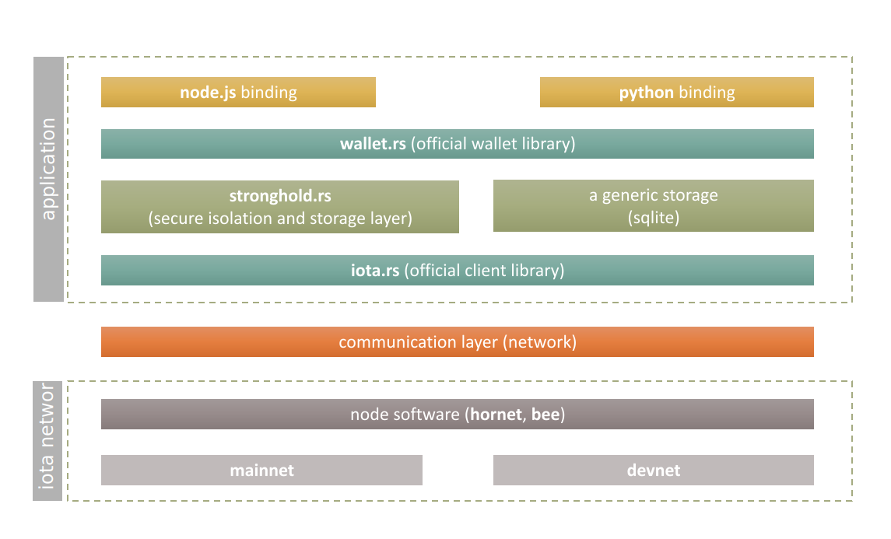

# Exchange guide

## The IOTA Wallet Library

> Easily integrate IOTA with your exchange, custody solution, or product

IOTA is built on an architecture that was designed to be the Backbone of the Internet of Things (IoT) environment of the future. This architecture has made it more challenging for service providers like exchanges to integrate IOTA compared to traditional blockchains. With the Chrysalis update, we ship many [client libraries](../libraries/overview.md) to help developers implement IOTA into their applications:


## How do I implement it to my exchange?

In [wallet.rs](../libraries/wallet.html), we use an account model, so you can create an account for each of your users. The other approach would be to use one account and generate many addresses, which you can link to your users in your database. Since IOTA addresses in Chrysalis network are perfectly reusable, addresses can be mapped to your users in a clear and concise way.

- Create an account for every user -> `Multi Account` approach
- Create one account with many addresses -> `Single account` approach

The library supports derivation for multiple accounts from a single seed. An account is simply a deterministic identifier from which multiple addresses can be further derived. 

The following illustrates the relationships between seed, accounts and addresses. The library allows consumers to assign a meaningful alias to each account. In addition to that, generated individual accounts can be also looked up via generated addresses and so does not matter whether one know alias or address, the searching for the related account is very straightforward with `wallet.rs` library.

It also leaves the choice to users if they want to segregate their funds across multiple accounts or multiple addresses. 


### Multi account approach

The multi account approach is to create an account for each individual user. The created accounts can then be linked to the internal user ids as an account alias and are clearly separated.

### Single account approach

The single account approach is to just use one account and create addresses for each individual user. The associated addresses are then linked to the internal user ids and store who owns which address in the database. Most exchanges are more familiar with the single account approach and find it easier to use, implement, and backup.

## Implementation guide

This guide explains how to use the IOTA Wallet Library to successfully implement IOTA into an exchange. If you already implemented the IOTA Hub, please visit the [Hub Migration Guide](./hub_guide.md).

Features of the Wallet Library:
- Secure seed management
- Account management (with multiple accounts)
- Confirmation monitoring
- Deposit address monitoring
- Backup and restore functionality

## How does it work?

The Wallet Library is a stateful package with a standardized interface for developers to build applications involving IOTA value transactions. It offers abstractions to handle IOTA payments and can optionally interact with IOTA Stronghold for seed handling, seed storage, and state backup. Alternatively, you can use a SQLite database.

See the [full documentation here](https://wallet-lib.docs.iota.org).

The following examples cover the *multi account approach* using `NodeJS`:

1. Setup the Wallet Library
2. Create an account for each user
3. Generate an user address for deposits
4. Listen to events
5. Check the user balance
6. Enable withdrawals

If you are looking for other languages, read the [wallet library overview](/libraries/wallet.md).

Anyway, since all `wallet.rs` bindings are based on core `wallet.rs` library, the approach is quite standardized regardless a programming language of your choice.

### 1. Setup the Wallet Library

Install the Wallet Library and dotenv for password management. Read more about [backup & security here](backup_security.md).

```bash
npm install @iota/wallet dotenv
touch .env
```

Input your password to the `.env` file like this:

```bash
SH_PASSWORD="here is your super secure password"
```


Import the Wallet Library and create a manager.

```javascript
    const { AccountManager, SignerType } = require('@iota/wallet')

    // Setup IOTA Wallet Library
    const manager = new AccountManager({
        storagePath: './storage'
    })
    manager.setStrongholdPassword(process.env.SH_PASSWORD)
    manager.storeMnemonic(SignerType.Stronghold, manager.generateMnemonic())

```


### 2. Create an account for an user

Create an account for every user and store it as the main scenario.

```javascript
    let account = await manager.createAccount({
        alias: user_id, // an unique id from your exisitng user
        clientOptions: { node: 'http://api.lb-0.testnet.chrysalis2.com', localPow: false }
    })
```


### 3. Generate an user address to deposit funds

```javascript
    // Always sync before account interactions
    console.log('syncing...')
    const synced = await account.sync()
    console.log('synced!')

    // By design, the last address of each account is an unused address which can be used as deposit address
    const latestAddress = account.latestAddress()

    console.log('Need a refill? Send it to this address:', latestAddress)
```
Fill the address with Testnet Tokens with the [IOTA Faucet](https://faucet.testnet.chrysalis2.com/).


### 4. Listen to events

Fetch existing accounts and listen to transaction events coming into the account.

```javascript
    const { addEventListener } = require('@iota/wallet')

    const callback = function(err, data) {
        if(err) console.log("err:", err)
        console.log("data:", data)
    }

    //Adds a new event listener with a callback in the form of (err, data) => {}. Supported event names:
    addEventListener("BalanceChange", callback)

    // Possible Event Types:
    //
    // ErrorThrown
    // BalanceChange
    // NewTransaction
    // ConfirmationStateChange
    // Reattachment
    // Broadcast

```

Example output:

```bash
data: {
  accountId: 'wallet-account://1666fc60fc95534090728a345cc5a861301428f68a237bea2b5ba0c844988566',
  address: {
    address: 'atoi1q9c6r2ek5w2yz54en78m8dxwl4qmwd7gmh9u0krm45p8txxyhtfry6apvwj',
    balance: 20000000,
    keyIndex: 0,
    internal: false,
    outputs: [ [Object], [Object] ]
  },
  balance: 20000000
}
```

Read more about Events in the [API reference](https://wallet-lib.docs.iota.org/libraries/nodejs/api_reference.html#addeventlistenerevent-cb).

### 5. Check the user balance

Get the available account balance.

```javascript
    // Always sync before account interactions
    console.log('syncing...')
    const synced = await account.sync()
    console.log('synced!')
    let balance = account.balance().available
    console.log('available balance', balance)
```

### 6. Enable withdrawals

```javascript

    console.log('syncing...')
    const synced = await account.sync()
    console.log('available balance', account.balance().available)

    const address = 'atoi1qykf7rrdjzhgynfkw6z7360avhaaywf5a4vtyvvk6a06gcv5y7sksu7n5cs'

    // TODO: Check if address is valid.

    const amount = 1000000 // Amount in IOTA: 1000000 == 1 MIOTA

    const node_response = await synced.send(
        address,
        amount
    )

    console.log("Check your message on https://explorer.iota.org/crysalis/message/", node_response.id)
```

