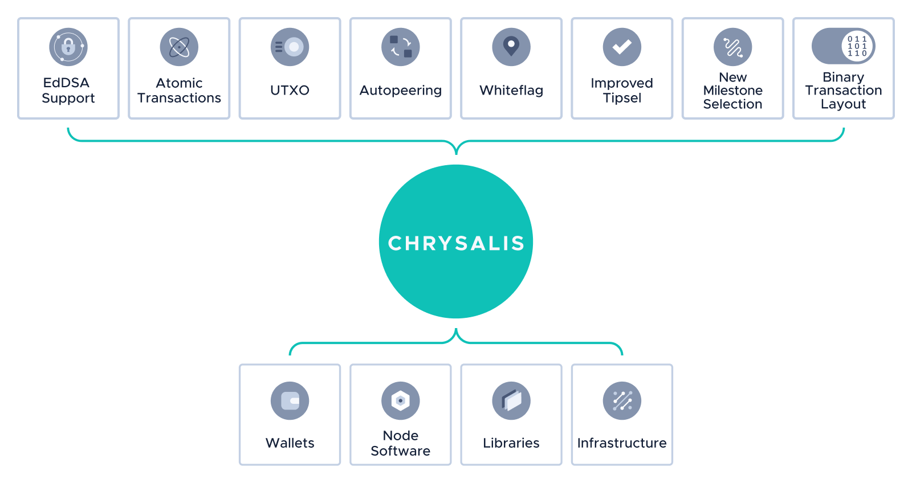
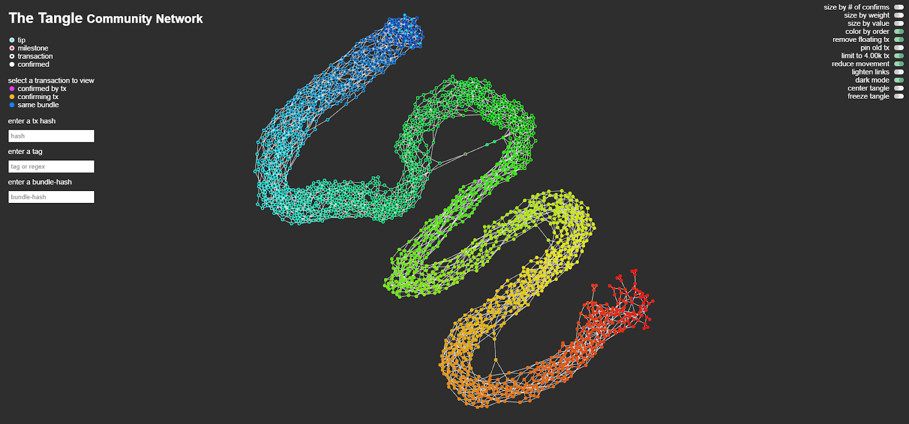

# Path to Chrysalis

One of the IOTA Foundation’s primary roles is to define and deliver on a development roadmap that moves IOTA towards production-readiness and adoption. In a complex and ever-changing ecosystem like DLT, having a clearly defined vision — and strategy on how to get there — is the key to success.

The IOTA mainnet has been operational since 2016 and so defining a new engineering strategy involves adapting our assumptions to industry feedback and demands. It also involves making difficult decisions to discontinue or redefine certain projects that are no longer feasible or relevant. At the core of this new strategy is an exclusive focus on technologies that will see adoption within a 2-year timeframe.

Research on Coordicide identified many new concepts that are incredibly valuable when implemented on the IOTA mainnet today. This led us to formalize our engineering strategy around Chrysalis (IOTA 1.5), a series of upgrades to the protocol that achieves enterprise-readiness before Coordicide.  

The benefit of this approach is that much of the heavy lifting and migration for token holders and developers will take place before the launch of Coordicide, making for a simpler transition between Chrysalis (IOTA 1.5) and Coordicide (IOTA 2.0) upgrades.

The IOTA Foundation’s objective over the next two quarters is to successfully specify, implement, test and upgrade the IOTA mainnet (and adjacent technologies) to this new version of the protocol.

The intended outcomes for Chrysalis are:

- **Simple transition to Coordicide**: 
With Coordicide making significant progress and the Alphanet launch coming soon, we want to ensure that all developers and companies building on Chrysalis will not see any major breaking changes with the later transition to Coordicide.
- **Substantial performance improvements**: 
With the changes introduced by Chrysalis, we will see a substantial improvement in the scalability and reliability of the IOTA Mainnet. The mainnet will be able to handle several hundred TPS.
- **Improved developer experience**: 
The new protocol features, new libraries, new modules and new wallet will make IOTA one of the best platforms to build on, removing the friction which developers experience today.
- **Accelerated adoption**: 
Chrysalis will make IOTA enterprise-ready, with stable and reliable technologies that will enable Startups, Corporations and Governments to develop and launch products powered by IOTA.

## The Stages to Chrysalis

The Chrysalis upgrade is a complex undertaking. We have to coordinate a number of distinct products to ensure a smooth transition for IOTA’s current users and partners. Apart from the core Node software, we also need to update our Wallet software, our Libraries, and the entireInfrastructure.  

Another important requirement is the ease of transition to the future Coordicide network. By carefully planning the breaking changes introduced along the way, and providing support in our developer tools, we will ensure that our growing ecosystem of developers, startups and corporations can reliably develop and launch new innovative products on IOTA.  

The plan for implementing Chrysalis is divided into two phases.

The first phase consists of improved tip selection (URTS), Milestone selection,White flag and Autopeering. These will be implemented in the node software gradually, with estimated completion by early July. This phase will require an upgrade of all nodes, including the coordinator node, and will not require a snapshot.  

The outcome of the first phase of Chrysalis will be:

- Transaction confirmation times of around 10 seconds
- Transactions only very rarely need reattachment
- A substantial TPS increase on mainnet
- Performance and reliability improvements for nodes
- Reduced node setup times through autopeering

The second phase consists of UTXO, Atomic Transactions, Reusable addresses (Ed25519) and the transition to a binary transaction layout. These represent significant changes to the core protocol and the way transactions are structured. Once everything has been tested, validated and audited, we will perform a global snapshot to allow the entire network, wallet users and exchanges to upgrade. We currently estimate this to happen around late October.  

The outcome of the second phase of Chrysalis will be:

- Reusable addresses and support for more standard cryptography (EdDSA), making hardware support for all major architectures possible
- Simplified transaction layout and a reduction in transaction size, further increasing performance
- Introduction of new features such as tokenized assets (colored coins)
- Significant improvements to the usability and reliability of IOTA

Node operators and integration partners will need to upgrade their nodes to stay in sync with the network and update any software with IOTA integration. We will reach out directly to exchanges, our partners and the wider community to guide them through this process.

The introduction of Reusable addresses is an important change for token holders. This will vastly improve IOTA’s usability and make integration into new exchanges, wallets and payment systems much simpler. We are building a new wallet that will allow token holders to transition from the current WOTS address scheme to the new EdDSA scheme.  

Our goal is to make this transition as seamless as possible for everyone in the IOTA ecosystem. This includes a variety of improvements and updates to our libraries and software, as well as training and educational sessions for our partners. We want to ensure that everyone is fully aware of how the future of the IOTA protocol will look and function, and what they need to do in order to upgrade.

### From Plan to Action

Going into Chrysalis, we’ve had to make decisions on how to best implement these upcoming changes, ensuring a correct and timely implementation and seamless transition from our current state to Chrysalis and later to Coordicide. What follows is an overview of the various components we are working on to successfully implement this new future for IOTA.

### Specification and Standardization

Specifications are a major part of our new development process. All our new software projects (Node software, Wallet, Identity, Access, Streams, etc.) will have full specifications. Specifications make it possible for external parties to follow a project’s intended functionality (e.g. for audits) or develop their own implementations in different languages. The specification process, which is also being followed by the Coordicide research team, is key to the standardization of IOTA and its related products.

For all the upcoming Chrysalis changes, we have introduced Protocol RFCs. Many Chrysalis components have been fully specified, and we intend to have them all completed by the end of May. We welcome any input from the IOTA and broader community. The list of RFCs is:  

- [Improved tip selection(URTS)](https://github.com/luca-moser/protocol-rfcs/blob/rfc-urts-tip-sel/text/0008-weighted-uniform-random-tip-selection/0008-weighted-uniform-random-tip-selection.md)
- [Milestone selection](https://github.com/Wollac/protocol-rfcs/blob/milestone-merkle-validation/text/0012-milestone-merkle-validation/0012-milestone-merkle-validation.md)
- [White flag](https://github.com/thibault-martinez/protocol-rfcs/blob/rfc-white-flag/text/0005-white-flag/0005-white-flag.md)
- [UTXO](https://github.com/hmoog/protocol-rfcs/blob/master/text/0011-utxo-model/0011-utxo-model.md)
- [Reusable addresses(Ed25519)](https://github.com/Wollac/protocol-rfcs/blob/ed25519/text/0009-ed25519-signature-scheme/0009-ed25519-signature-scheme.md)
- [Binary transaction layout](https://iota.cafe/t/binary-transaction-layout/324)

### Wallet support

The Trinity wallet is the most popular wallet in IOTA today. With Chrysalis, there is also a new wallet, called [Firefly](https://blog.iota.org/firefly-iota-next-generation-wallet-26bdd4d01510/). The team has been working on a complete rethink of the wallet architecture, both for UX and UI but also from a security and functionality perspective. At its core will be a new Wallet library written in Rust, to allow other developers to easily implement IOTA wallets within their applications. Another new Rust library, Stronghold, will enable ultra-secure secret handling and storage.  

### Infrastructure

Currently, the IOTA Foundation supports two public Networks: Mainnet and Devnet (Devnet is for PoCs and application tests). Both networks provide public endpoints for users and partners. You can read more about the networks and how you can participate in our [documentation](https://docs.iota.org/getting-started/0.1/network/iota-networks?q=Devnet&highlights=devnet).  

We will be migrating both Devnet and Mainnet to operate on Hornet, and later on both Hornet and Bee nodes. This will make both networks easier to maintain, and improve their throughput.

[Comnet](https://comnet.thetangle.org/), a community network of Hornet nodes, operates at a stable rate of 40–100 TPS currently, and has already achieved 300 TPS in stress tests without any Chrysalis components yet.

With these infrastructure upgrades and the transition to Chrysalis, we will continue to be in close contact with all of our exchange and integration partners and provide them with close assistance and advice.

See the live visualization of the Comnet: https://graph.comnet.manapotion.io/  

### Chrysalis Testnet
Nodes deployed to the testnet can be queried using a load balancer at:

- api.lb-0.testnet.chrysalis2.com

We recommend using the load balancer for most scenarios.

Single node endpoints that expose native MQTT in case you need this are:

- api.hornet-0.testnet.chrysalis2.com
- api.hornet-1.testnet.chrysalis2.com
- api.hornet-2.testnet.chrysalis2.com
- api.hornet-3.testnet.chrysalis2.com

## Conclusion

Chrysalis is the most promising series of upgrades made to IOTA yet. It is a major step for our enterprise-readiness, with increased transaction throughput, network stability, improved usability, and enables new features and use cases. The upcoming weeks and months are some of the most exciting in IOTA’s history. We are on a clear path towards IOTA’s adoption as an enabling technology for IoT and beyond.